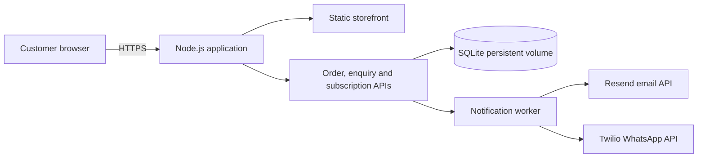
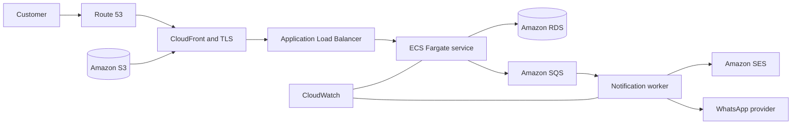

# Agrodolce Cloud Storefront


A cloud-ready ordering platform for **Agrodolce**, a home bakery in Devanahalli, Bengaluru. Customers can browse products, build a basket, request pickup, submit special-occasion enquiries, and subscribe to new-product updates.

The project currently runs as a containerised Node.js application with SQLite persistence. Its modular boundaries allow storage, messaging, and deployment components to move to managed cloud services as the bakery grows.

> **Project status:** Preview. Products, prices, photographs, and notification credentials must be finalised before production use.

## Features

- Responsive single-page storefront for desktop and mobile
- Filterable product catalogue with INR pricing and egg/eggless information
- Persistent browser basket with server-calculated totals
- Guest order requests with preferred pickup date and time
- Separate special-occasion enquiry workflow
- Email and WhatsApp subscription preferences for product announcements
- Durable request storage with duplicate-submission protection
- Email and WhatsApp notification adapters with retry handling
- Preview mode for safe demonstrations and client review
- Docker image for repeatable local and cloud deployment
- Server-side validation, request limits, origin checks, and private configuration

## Architecture



The current version is designed for one application instance with a persistent disk. SQLite stores customer requests and subscriptions, while a background worker retries notifications independently of request submission.

### Target AWS architecture



This AWS-native design is the planned evolution, not the current deployment. It replaces the local database with RDS, notification polling with SQS, external image URLs with S3 and CloudFront, and application logs with CloudWatch.

## Technology

| Area | Current implementation | Planned cloud evolution |
| --- | --- | --- |
| Frontend | HTML, CSS, native JavaScript modules | CloudFront delivery and S3-hosted assets |
| Application | Node.js 24 HTTP server | Docker container on ECS Fargate |
| Storage | SQLite on a persistent volume | Amazon RDS for PostgreSQL |
| Queue | Database-backed retry worker | Amazon SQS with a dead-letter queue |
| Email | Resend adapter | Resend or Amazon SES |
| WhatsApp | Twilio adapter | Twilio or Meta WhatsApp Cloud API |
| Observability | Process logs | CloudWatch logs, metrics, and alarms |
| Infrastructure | Dockerfile | Infrastructure as Code and CI/CD |

## Project structure

```text
.
├── public/                     # HTML and public brand assets
├── src/
│   ├── content/                # Editable catalogue and enquiry options
│   ├── features/               # Catalogue, basket, forms and subscriptions
│   ├── server/
│   │   ├── notifications/      # Email and WhatsApp adapters
│   │   ├── index.js            # HTTP server and API routes
│   │   ├── storage.js          # SQLite persistence adapter
│   │   └── validation.js       # Trusted request validation
│   ├── shared/                 # Shared browser utilities
│   └── styles/                 # Design system and responsive styles
├── tests/                      # API and browser tests
├── Dockerfile                 # Production container definition
├── .env.example               # Environment variable template
└── docs/website-plan.md        # Product scope and design decisions
```

## Run locally

### Prerequisites

- Node.js 24 or later
- npm

Clone the repository, then run:

```bash
npm install
cp .env.example .env
npm run dev
```

Open [http://localhost:3000](http://localhost:3000).

The default configuration uses `PREVIEW_MODE=true`. Preview submissions are stored locally as test data, and notification providers are not called.

## Run with Docker

Build the image:

```bash
docker build -t agrodolce-storefront .
```

Run it with persistent storage:

```bash
docker run --name agrodolce \
  --env-file .env \
  -p 3000:3000 \
  -v agrodolce-data:/data \
  agrodolce-storefront
```

Open [http://localhost:3000](http://localhost:3000). The named Docker volume preserves orders, enquiries, and subscriptions when the container restarts.

## Configuration

Copy `.env.example` to `.env`. Never commit the completed `.env` file.

| Variable | Purpose |
| --- | --- |
| `PORT`, `HOST` | HTTP server address |
| `PREVIEW_MODE` | Keeps submissions and notifications in test mode |
| `SITE_ORIGIN` | Exact public website origin allowed to submit forms |
| `DATA_DIR` | Directory containing the private SQLite database |
| `RESEND_API_KEY` | Resend API credential |
| `EMAIL_FROM`, `BAKER_EMAIL` | Sender and baker notification addresses |
| `TWILIO_ACCOUNT_SID`, `TWILIO_AUTH_TOKEN` | Twilio credentials |
| `TWILIO_WHATSAPP_FROM`, `BAKER_WHATSAPP_TO` | WhatsApp sender and recipient |
| `TWILIO_CONTENT_SID` | Approved WhatsApp notification template |

Live mode refuses to start unless both notification providers are configured. Provider configuration must still be tested before launch.

## Editing products

Products, prices, categories, units, descriptions, dietary labels, and special-order options live in [`src/content/catalogue.js`](src/content/catalogue.js).

Prices are stored in paise:

```js
price: 85000, // ₹850
```

Add approved product images to `public/images/` and reference them with a public path:

```js
image: '/images/chocolate-cake.jpg',
```

The current Unsplash photographs and SVG brand mark are placeholders. Replace them with approved bakery assets before production.

## Data and notifications

SQLite data is stored at `.data/requests.sqlite` locally and `/data/requests.sqlite` in the container. It contains customer contact details and must be private, access-controlled, backed up, and covered by a retention policy.

Requests are committed before notifications are attempted. Failed provider calls are retried with exponential backoff. A provider-accepted response confirms API acceptance only; it does not prove delivery or that the baker read the message.

Subscriptions record the selected channel, normalised contact details, consent version, timestamp, and preview/live status. The current feature collects consent only. A production campaign workflow still requires unsubscribe handling, verified live subscribers, and an approved WhatsApp marketing template.

## Testing

Run the server and API test suite:

```bash
npm test
```

Run browser checks:

```bash
npx playwright install chromium
npx playwright test
```

The tests cover orders, special enquiries, subscriptions, server-calculated prices, duplicate prevention, invalid input, private-file protection, notification retry behaviour, and responsive layouts.

## Cloud deployment roadmap

- [x] Modular storefront and server API
- [x] Container image and persistent local storage
- [x] Preview/live configuration boundary
- [x] Email and WhatsApp notification adapters
- [ ] Replace placeholder products, imagery, logo, and bakery biography
- [ ] Provision AWS networking, container runtime, secrets, and HTTPS
- [ ] Move customer data from SQLite to Amazon RDS
- [ ] Move notification jobs to SQS with a dead-letter queue
- [ ] Store product images in S3 and serve them through CloudFront
- [ ] Add CloudWatch dashboards, alarms, and structured logs
- [ ] Add CI/CD for tests, image publishing, and controlled deployments
- [ ] Add subscriber opt-out and campaign management
- [ ] Add backup, restore, data-retention, and incident procedures

## Deployment constraints

The current SQLite version must run as a single Node.js process with a persistent disk. It is suitable for a small VM, Lightsail instance, or single container host. It is not suitable for multiple replicas or ephemeral serverless storage.

Before accepting real customer data, enable HTTPS, configure edge rate limiting, protect secrets with a managed secret store, test backups and restoration, and verify email and WhatsApp delivery end to end.

## Scope

Online payments, customer accounts, delivery, an admin dashboard, and automatic subscriber campaigns are outside the current release. The baker confirms availability, pricing for special requests, pickup details, and order acceptance privately.

See [the website plan](docs/website-plan.md) for the agreed product scope and module boundaries.

## License

This project is currently private and has no open-source license. Add a license before accepting third-party contributions or reuse.
